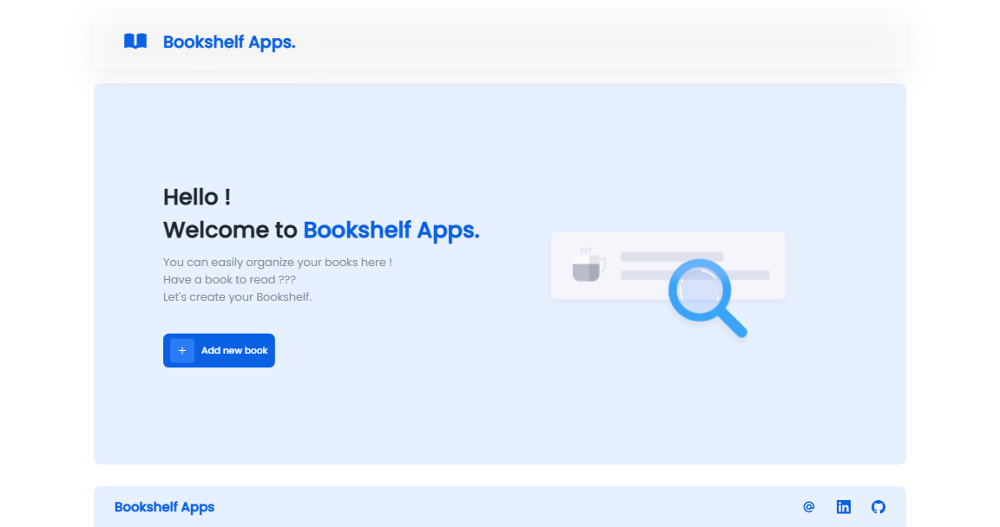

<h1 align="center">Bookshelf Apps</h1>

<a href="https://juniorimam.github.io/bookshelf-apps" style="text-decoration:none;">Go to Demo Page</a>

This project was created to complete the Front-End Web for Beginners class from Dicoding.
Bookshelf Apps can recording and organizing books that you want to read or those that have been read

## How to use

- First, you must add your first book
- Then you can set which book you want to read or have been read

You can delete your book if you want, but if you need a deleted book, you have to add your book again.

## Technology Used

- HTML
- CSS
- Javascript

## Author

This website was created by [Junior Imam Nugroho](https://github.com/juniorimam)
